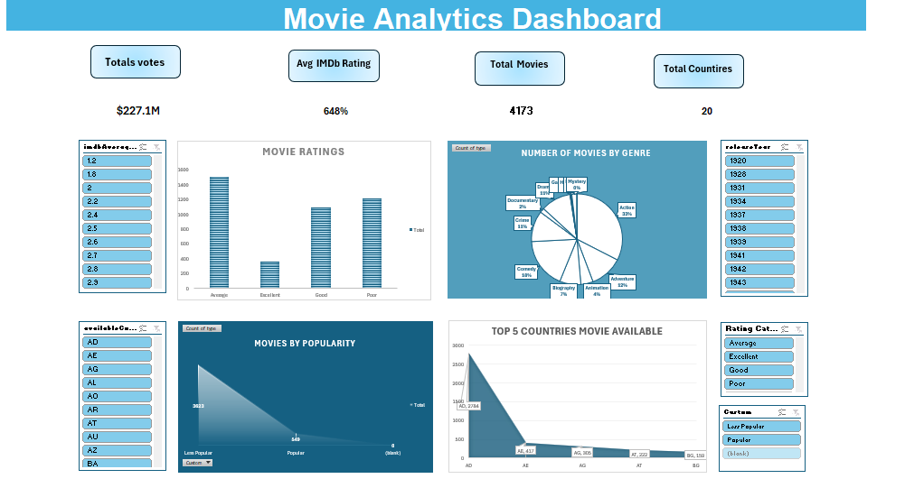
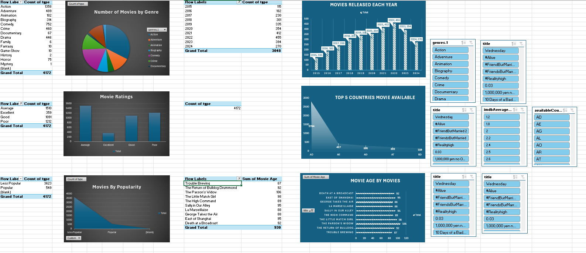
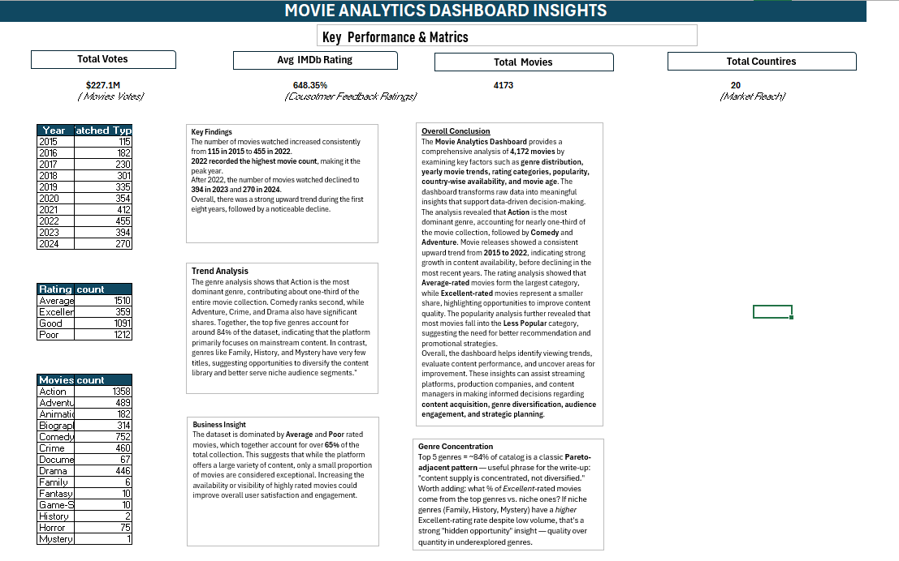

# 🎬 Netflix Movies Recommendation Analysis Dashboard

## 📌 Project Overview
This project presents an interactive Netflix Movies Recommendation Dashboard created using Microsoft Excel. The dashboard provides insights into movie genres, ratings, release years, and country-wise distribution through Pivot Tables, Pivot Charts, and Slicers.

---

## 📊 Dashboard Preview

### Main Dashboard

### Pivot Analysis

### Insights

---

## 🎯 Objectives
- Analyze Netflix movie dataset.
- Identify the most popular genres.
- Explore movie distribution by release year.
- Understand rating categories.
- Build an interactive Excel dashboard.

---

## 🛠 Tools Used
- Microsoft Excel
- Pivot Tables
- Pivot Charts
- Slicers
- Conditional Formatting
- Data Cleaning

---

## 📂 Project Files

| File | Description |
|------|-------------|
| Netflix_Movie_Recommendation.xlsx | Excel Dashboard |
| Dashboard.png | Dashboard Screenshot |
| Pivot.png | Pivot Table Analysis |
| Insight.png | Business Insights |

---

## 📈 Key Insights
- Action is the most popular movie genre.
- Comedy and Adventure also have a high number of titles.
- The dashboard allows interactive filtering using slicers.
- Pivot Charts provide quick visual analysis.

---

## 🚀 Skills Demonstrated
- Data Cleaning
- Data Analysis
- Dashboard Design
- Pivot Tables
- Pivot Charts
- Excel Visualization

---

## 👩‍💻 Author

**Ritesh Rathod**

Aspiring Data Analyst | Excel | SQL | Python | Power BI

